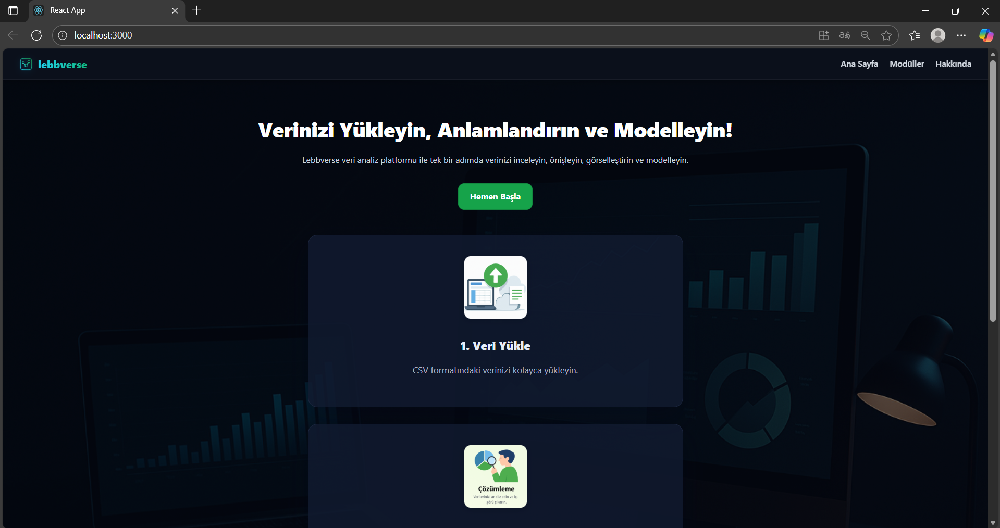
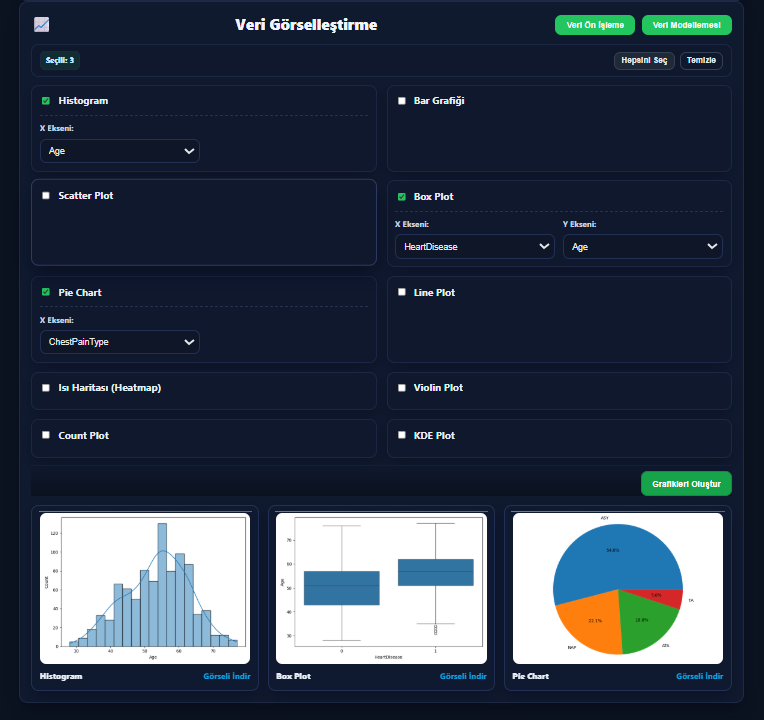
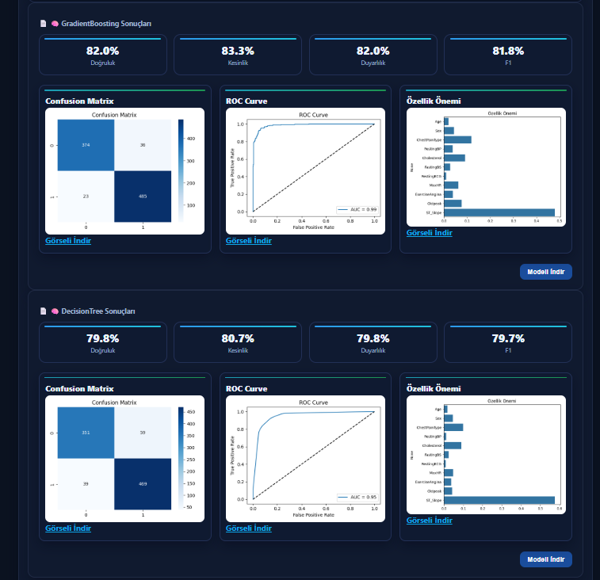

<h1 align="center">🌌 Lebbverse</h1>

  <b>Veri yüklemeden model karşılaştırmasına kadar tek ekranda, uçtan uca makine öğrenimi deneyimi.</b> 
  Basit, modüler, etkileşimli ve tamamen görsel.

---

## 🚀 Özellikler

- 📁 **Veri Yükleme** — CSV/Parquet dosyalarını önizle, kolonları otomatik algıla.  
- ⚙️ **Ön İşleme** — Eksik değer tamamlama, encoding ve ölçekleme adımlarını uygula.  
- 📊 **Görselleştirme** — Histogram, dağılım, korelasyon ve kutu grafikleri oluştur.  
- 🤖 **Modelleme** — Birden çok algoritmayı aynı anda eğit, sonuçları karşılaştır.  
- 📈 **Metrik Tablosu** — Accuracy, Precision, Recall, F1, ROC-AUC gibi metrikleri otomatik hesapla.  
- 🌓 **Karanlık Tema** — Modern, sade ve odaklı kullanıcı deneyimi.  

---

## 🧠 Genel Akış

Veri Yükleme → Ön İşleme → Görselleştirme → Modelleme → Sonuç ve Karşılaştırma  

Lebbverse, tipik bir makine öğrenimi sürecini tek bir akışta birleştirir.  
Her modül, kendi bileşeni içinde izole çalışır ve üst seviye state yönetimi ile entegre olur.  

---

## 🧩 Kullanılan Teknolojiler

| Kategori | Teknoloji | Açıklama |
|-----------|------------|----------|
| 🐍 Backend | **Python** | Makine öğrenimi ve veri işleme çekirdeği |
| 🔥 Framework | **Flask** | API servisleri ve model entegrasyonu |
| ⚛️ Frontend | **React** | Dinamik ve bileşen tabanlı kullanıcı arayüzü |
| 💅 Stil | **CSS / Tailwind** | Modern, karanlık temalı ve duyarlı tasarım |
| 📊 Görselleştirme | **Recharts / Chart.js** | Etkileşimli grafikler ve metrik görselleri |
| 🧠 ML Kütüphaneleri | **Scikit-Learn / Pandas / NumPy** | Modelleme, veri işleme ve analiz altyapısı |
| 🌙 Tema | **Custom Dark Theme** | Özel renk paleti ve kart tasarımı |

---

## 💡 Kullanım Adımları

1. **Veriyi yükle**  
   CSV dosyanı yükle, kolonları otomatik algılat.  

2. **Veriyi hazırla**  
   Eksik değerleri doldur, encoding uygula, ölçekleme yap.  

3. **Veriyi keşfet**  
   Görselleştirme modülünden histogram, kutu, dağılım ve korelasyon grafikleri oluştur.  

4. **Model oluştur**  
   Algoritmaları işaretle (ör. RandomForest, SVM, XGBoost), parametreleri ayarla, modeli eğit.  

5. **Sonuçları karşılaştır**  
   Tüm modellerin metrik tablosunu ve kıyas grafiklerini incele.  

---

## 🖼️ Görseller

<table>
  <tr>
    <td align="center"><b>Ana Sayfa</b></td>
    <td align="center"><b>Görselleştirme</b></td>
    <td align="center"><b>Model Karşılaştırma</b></td>
  </tr>
  <tr>
    <td></td>
    <td></td>
    <td></td>
  </tr>
</table>

---

## 🤝 Katkı Sağla

1. Bu depoyu forklayın  
2. Yeni bir dal oluşturun
3. Değişikliklerinizi commit edin  
4. PR (Pull Request) açın  

> Kod stiline, bileşen yapısına ve proje bütünlüğüne dikkat edin.

---

## 🧾 Lisans
Bu proje MIT Lisansı ile sunulmaktadır. Ayrıntılar için [LICENSE](./LICENSE) dosyasına bakın.

---

  ✨ "Lebbverse — Machine Learning, Simplified." ✨

